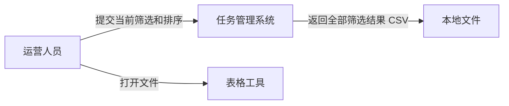
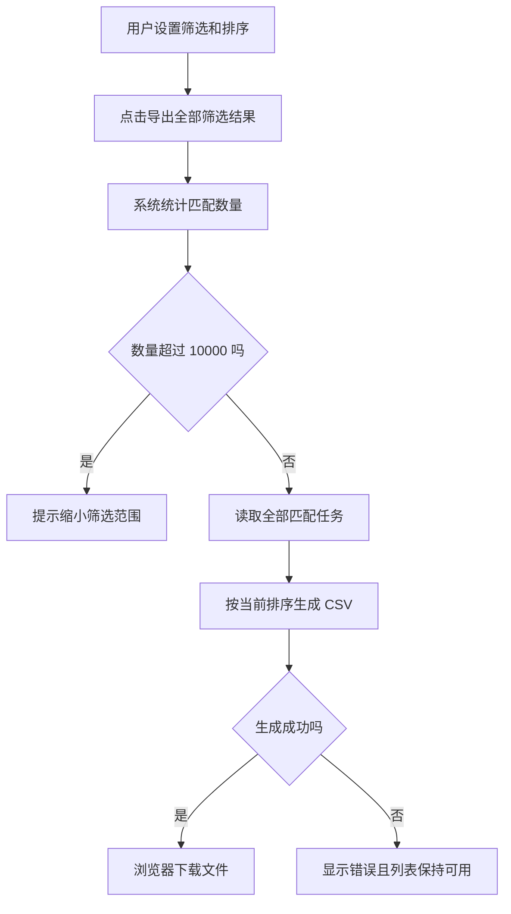
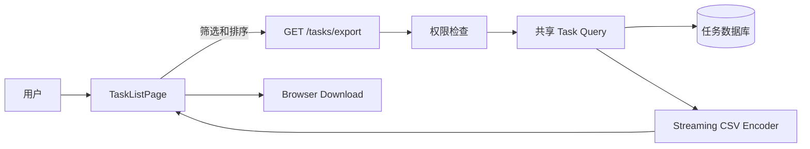
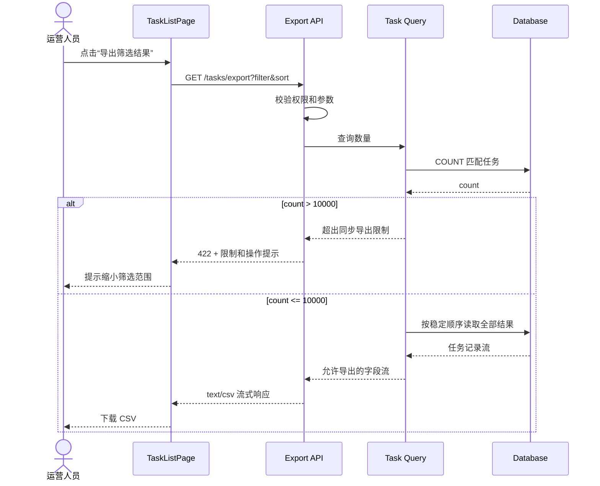

# 将任务导出范围从当前页改为全部筛选结果

## Change 类型

`demand-change`：当前实现正确满足了原需求，但用户对“导出”的目标范围已经改变。

## 需求定义

### 需求差异

| 需求项 | 变更前 | 变更后 |
|---|---|---|
| 导出范围 | 当前页面已经加载的最多 50 条任务 | 符合当前筛选条件的全部任务，最多 10,000 条 |
| 导出顺序 | 当前页面中的显示顺序 | 当前筛选结果的完整排序顺序 |
| 超限处理 | 不涉及跨页结果 | 超过 10,000 条时不生成不完整文件，并提示缩小筛选范围 |
| 页面、接口文档和测试 | 描述为“导出当前页” | 描述为“导出筛选结果” |

### 需求不变

- 用户仍从任务列表发起导出，并使用当前筛选和排序条件。
- 仍只支持 CSV，字段、UTF-8 编码和转义规则保持不变。
- 页面列表继续分页，不增加后台任务、邮件发送或导出历史。
- 无结果时仍下载只包含表头的文件。

### 验收标准

- [ ] 结果不超过一页时，导出内容与当前版本一致。
- [ ] 结果跨越多个分页时，每条符合条件的任务恰好出现一次。
- [ ] 导出顺序与页面当前排序规则一致。
- [ ] 修改筛选条件后，导出只包含新筛选结果。
- [ ] 超过 10,000 条时不生成不完整文件，并提示用户缩小范围。
- [ ] 页面、接口文档和测试不再把导出范围描述为“当前页”。

## 需求分析交付

### 系统上下文变化

参与方和外部边界没有变化，仍是运营人员从任务管理系统获得 CSV。变化发生在“系统选择哪些任务”这一规则中。



### 用例变化

- 原用例：导出当前页面已经加载的任务。
- 新用例：导出符合当前筛选条件的全部任务。
- 保持不变：用户仍从任务列表发起导出，文件格式和字段不变。

### 业务流程变化



### 数据和交互影响

任务实体、字段和状态均不变化，因此不需要新的 ER 图或状态图。页面按钮从“导出当前页”改为“导出筛选结果”，并在超过限制时展示可采取行动的提示。

```text
无法导出：当前筛选包含 12,438 条任务，单次最多导出 10,000 条。
请增加状态或日期筛选后重试。                         [知道了]
```

## 系统设计交付

### 当前与目标架构

当前设计只读取浏览器中的单页数据。新需求需要服务端按同一套筛选、权限和排序规则读取全部结果，因此增加专用导出接口，并复用任务查询规则。



组件边界：

- 页面只提交经过接口定义允许的筛选和排序参数。
- 导出接口复用列表查询的权限与筛选规则，不复制一套条件转换。
- `Task Query` 负责稳定排序和 10,000 条限制。
- `Streaming CSV Encoder` 负责字段选择、转义和流式响应，不持有业务筛选规则。

### 关键接口时序图



### 接口、数据和运行约束

- `GET /tasks/export` 接受与任务列表相同的筛选和排序字段，拒绝未知字段。
- 导出权限与列表读取权限完全一致，不能因专用接口绕过行级过滤。
- 不修改任务表和持久化数据，不新增数据库迁移。
- 使用稳定的次级排序键避免分页读取时重复或遗漏。
- 记录导出数量、耗时、失败类别和超过限制次数，不记录 CSV 内容。
- 复用现有 Web 服务部署，不改变网络拓扑；上线前验证大结果集不会突破现有响应超时和内存限制。

## 执行流程设计

本 change 使用一个 Pull Request 完成，因为查询规则、接口和页面文案需要作为同一个可验收行为交付：

1. 把列表筛选与排序规则收敛为列表和导出可复用的查询模块，并用现有行为测试固定语义。
2. 增加导出接口、数量限制、权限测试、稳定排序测试和 CSV 流式响应测试。
3. 将页面按钮改为请求导出接口，增加超限和请求失败提示。
4. 增加跨页、无结果、权限过滤、特殊字符和 10,001 条超限的端到端测试。
5. 更新用户文档和 API 文档，把“当前页”改为“全部筛选结果”。
6. 在 Preview 使用接近上限的数据量验证耗时、内存和真实文件内容。

实际进度、测试命令、Preview 结果和执行中发现的问题记录在 PR；如果数量限制或查询方案需要改变，再把设计结论同步回本 Issue。

## 关联

- 原需求：#142
- 实现 Pull Request：待创建
