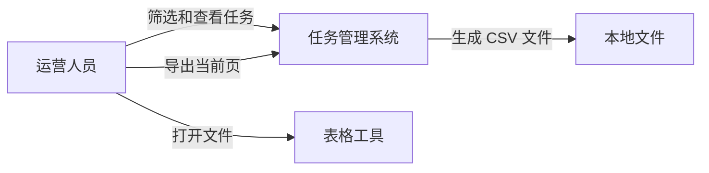
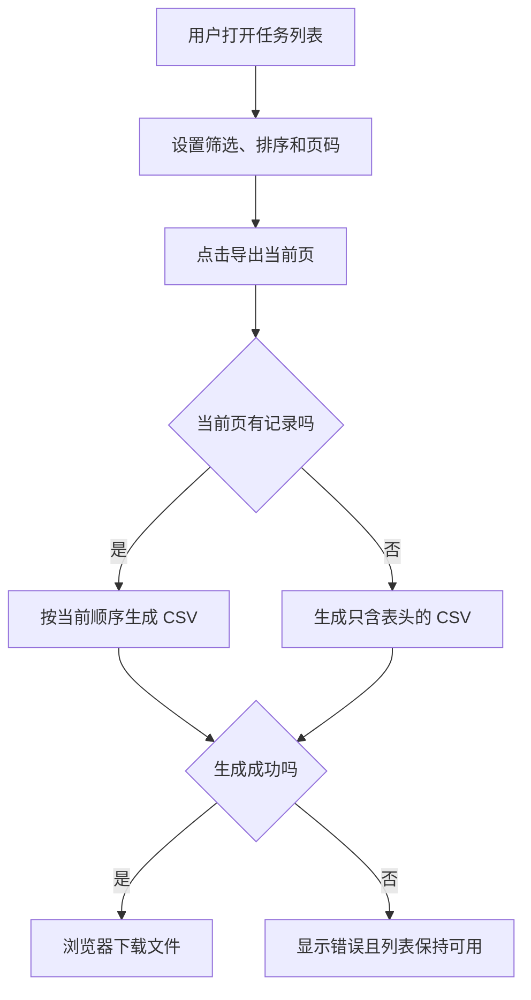
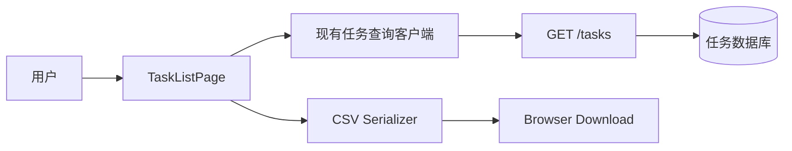
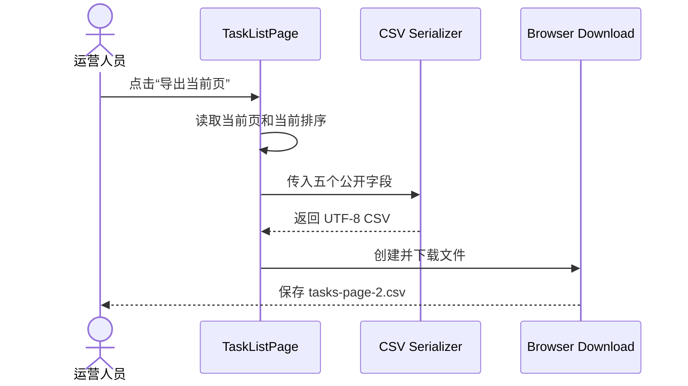

# 支持导出当前页任务 CSV

## Change 类型

`feat`：任务列表目前没有导出能力，本次新增当前页 CSV 导出。

## 需求定义

### 问题与目标

运营人员需要把任务列表中的一页结果交给表格工具继续处理。目前只能逐行复制，容易遗漏字段。

完成后，运营人员可以把当前页面已经加载的任务下载为 CSV。导出结果应与屏幕上的当前页、筛选条件和排序一致。

### 范围

- 在任务列表增加“导出当前页”操作。
- 导出当前页已经加载的任务，不额外请求其他分页。
- 字段包括任务 ID、标题、状态、创建时间和更新时间。
- 文件使用 UTF-8 编码，首行为字段名。

### 非目标

- 不导出其他分页或全部筛选结果。
- 不增加 Excel、JSON 或 PDF。
- 不提供定时导出、邮件发送或导出历史。
- 不改变现有筛选、排序和分页逻辑。

### 验收标准

- [ ] 当前页有任务时，可以下载只包含当前页记录的 CSV。
- [ ] 切换筛选、排序或页码后，导出内容与当前页面一致。
- [ ] 标题中的逗号、引号和换行可以被标准 CSV 工具正确读取。
- [ ] 当前页无结果时，下载只包含表头的文件。
- [ ] 导出过程不发送新的任务查询请求。

## 需求分析交付

### 系统上下文图：确认参与方和边界

本次只在任务管理系统内增加文件导出，不与新的外部服务集成。表格工具是文件使用方，不参与系统调用。



### 用例和功能清单：确认用户能做什么

- 在当前任务列表页面发起导出。
- 获得与当前页相同顺序和记录集合的 CSV。
- 使用常见表格工具打开包含特殊字符的内容。

### 业务流程图：确认主流程和异常



### 数据和交互说明

不新增业务实体和持久化数据，因此不需要 ER 图。CSV 每一行对应当前页面中的一个任务，只使用页面已经获得的五个公开字段。

页面交互原型：

```text
任务列表                         [导出当前页]
筛选：状态 [进行中]  日期 [本月]

ID       标题          状态       创建时间
T-103    核对账单      进行中     2026-09-20
T-104    更新资料      进行中     2026-09-21

                         第 2 / 6 页
```

任务本身的生命周期没有变化，因此不增加状态图。不存在多系统业务协作，因此不增加业务时序图。

## 系统设计交付

### 逻辑架构和组件变化

当前任务查询接口和分页保持不变。新增导出操作、CSV 序列化器和浏览器下载适配，全部位于 Web 客户端。



组件边界：

- `TaskListPage` 提供当前页可导出字段，不实现 CSV 转义。
- `CSV Serializer` 只接收明确字段并生成 CSV，不读取全局状态或重新请求数据。
- `Browser Download` 负责 Blob、文件名和下载，不理解任务字段。

### 关键接口时序图



如果序列化失败，页面显示错误并保留当前列表状态。该流程不调用后端接口，因此不会产生网络重试。

### 数据、安全和运行约束

- 不修改数据库、API、部署拓扑和服务端容量。
- 不导出页面未获得的内部字段或权限受限字段。
- CSV 注入防护规则沿用项目现有表格导出工具；若仓库没有该规则，在执行前将其列为阻塞问题。
- 失败记录进入现有前端错误监控，不新增监控系统。

## 执行流程设计

本 change 使用一个 Pull Request 完成：

1. 为 CSV 序列化器增加逗号、引号、换行和空结果测试。
2. 实现 CSV 序列化器与浏览器下载适配。
3. 在任务列表接入按钮、禁用状态和错误提示。
4. 增加页面交互测试，证明导出只使用当前页数据且不会发送新请求。
5. 更新用户文档，明确操作名称为“导出当前页”。

Pull Request 合并前应能逐项对应本 Issue 的五条验收标准。实际修改、命令结果和测试证据记录在 PR。

## 关联

- 实现 Pull Request：待创建
